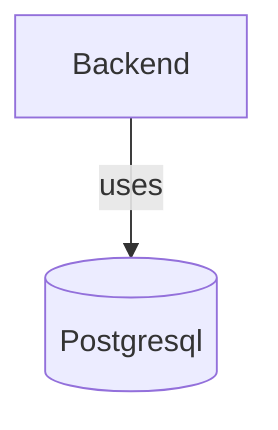
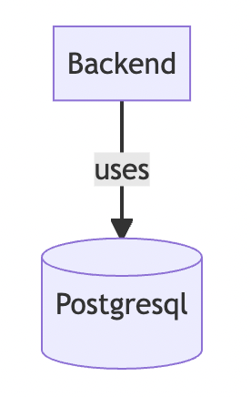

# Ruteho

Playground to work on microservices with different technologies I want to try out, learn or keep using.

The context will be an application for a fictional hotel. `The Great Ruteho 5*`

## Intro

The project will start with a simple backend with nodejs/typescript. I chose this language because
it is the one I enjoy the most and I am more fluent at.
Over time I will add more technologies and languages to it. In a real project I would never recommend that.
I am a fan of [Choosing boring technology](https://mcfunley.com/choose-boring-technology).

Nevertheless being a playground it makes sense to try how all these technologies work and how they fit together.

## Architecture

I will describe here the architecture in a very basic way. To find out more details about it,
I am keeing the decisions over the architecture in the [docs/adr](docs/adr/) folder.

I am documenting the Architecture thoroughly, with the latest state in [docs/architecture](docs/architecture).
One challenge of this playground will be to keep the docs up to date.

Current component diagram:

Since Github does not render mermaid diagrams, I am also attaching the image:

## Requirements

I am still deciding where requirements will live. I would like to make them as close to real life as possible
but at the same time I do not want to overcomplicate things too much in this area.

## Testing

There are 3 levels of testing in this project:

### Unit Tests

Test functions using doubles (mocks, stubs, etc) and they are run without starting the service they pretend to test or requiring other services (database, etc.) to be ran.
Being strict, this category might include some integration tests in the sense of testing how multiple functions or components work together within one service. But in this project, and since the concept of `Unit` is not universaly defined, I consider them `Unit tests`.

### BDD Tests

Contain tests that spawn one or more services, need the application (or part of it) to be started and are based on and
linked to functional requirements for the application. This tests will also include some quality attributes of these functions.
For example: ` the search endpoint should take less than 100ms in normal conditions`.

All tests in BDD need to reference the requirement(s) they verify and all requirements need to be tested by at least one test in BDD.

### System Tests

Contain tests that verify that some aspects of the system hold true but are not directly linked to requirements. I am not sure
at this time if we will need this kind of tests. My image for now is to test things like SLAs here, that might not be directly
related to a specific requirement.

This tests might be run against production environment to endure that the system is behaving as expected.
