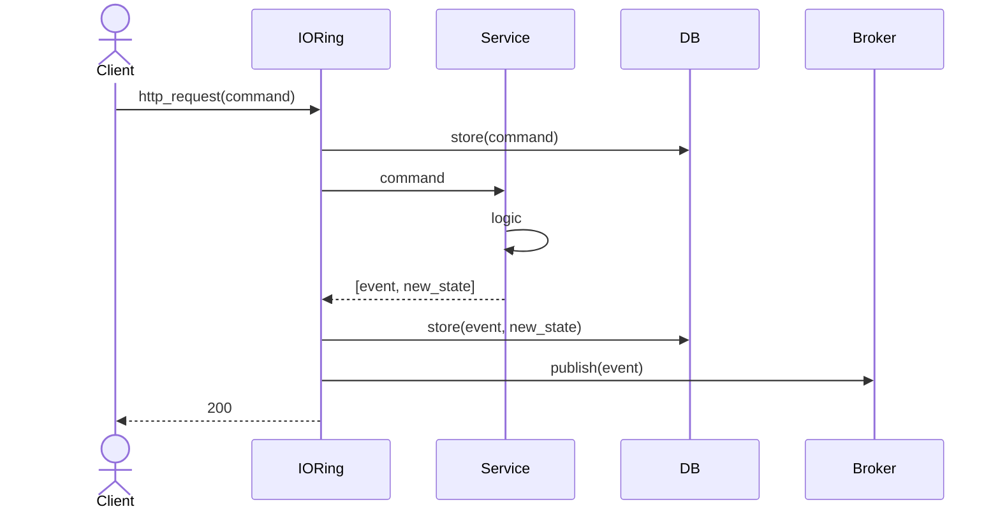
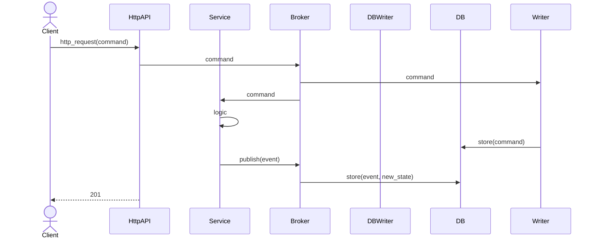
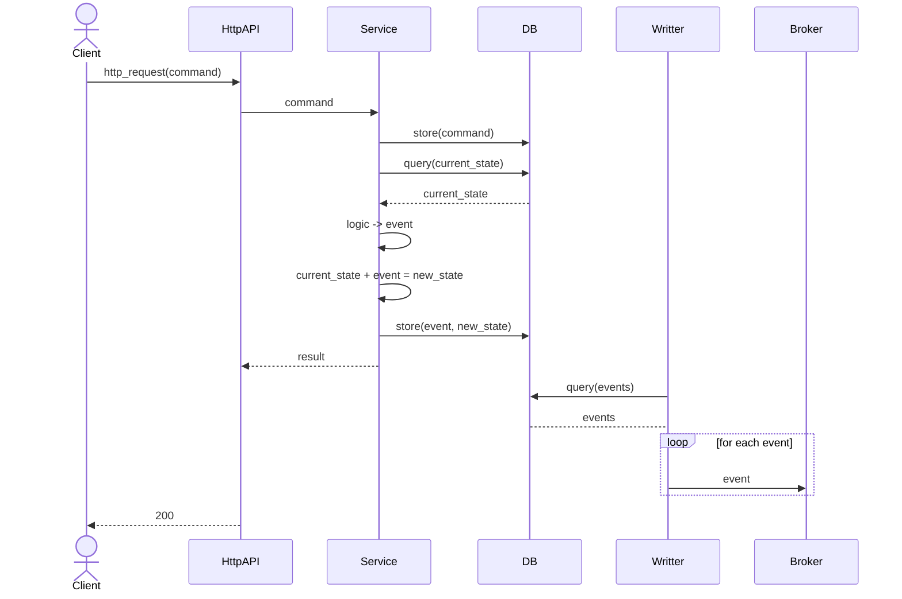
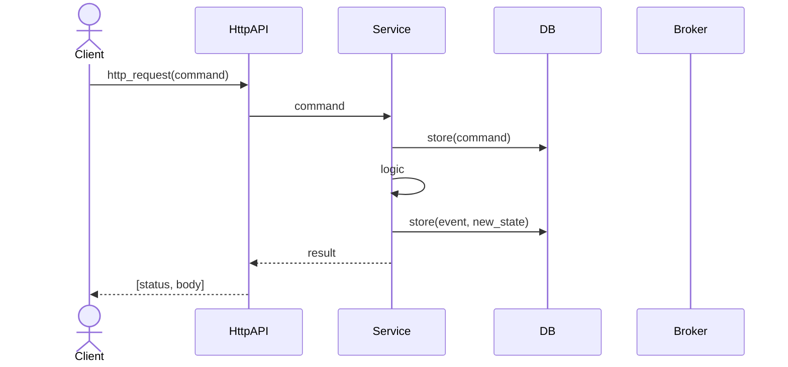

# Event/Command sourcing and traceability

## Introduction

- Store events and commands to analyse the systems interaction
- Add traceability betwen commands and events
- How to trace between events and new commands

- Think of separation of Inside events and Outside events. Offer the minimum information in the Broker.

Assuming Ports and Adapters / Onion architecture

### Analysis

#### Data structure

Think about traceability command -> event -> command -> event

##### Metadata

Schema:

```javascript
{

    "id": "uuid",
    "timestamp": "number" (~unix timestamp in UTC),
    "source": {
        "name": "string" (service/resource name),
        "version": "string"
    },
    "parentId": "uuid | null" (correlation of the command or event that produced this one),
    "type": "string" (event / command type),
    "channel": "string?" (where the command was sent / received from. Think of cases that an event is published to multiple brokers. Should we allow it?)

}
```

#### Flow

##### Option A - Command/Event storage handled in IO Ring



##### Option B - Broker centered Command/Event storage



##### Option C - DB centered Command/Event storage



##### Option C - IO handled in service



## Context and Problem Statement

## Analysis

## Proposed solution

## Status

Decided
