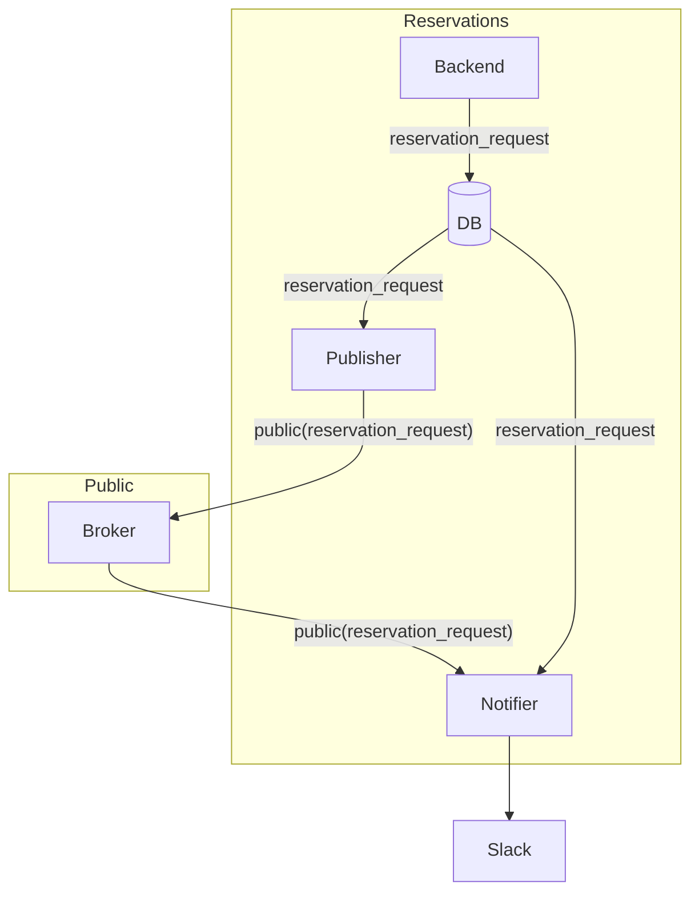

# Notify invalid reservations

## Context and Problem Statement

When an invalid reservation is imported we need to save it to let the user
manage it. For example they can correct it and save it as a valid reservation,
delete it, or go to the source and correct the error there.

In some cases it can be an urgent task (for example if the reservation is for today)
so the user expects to get a notification.

In this iteration we will send Slack messages for all the reservation_requests. We will filter them in the future.

## Analysis

### Current status

As part of importing the reservations we are storing both the state change and the event. So we can already use the event to syncronize with other parts of the application.

### Extensibility

Although we want to implement the notifications, it is possible that we need to use the
event for other purposes in the future. At the same time it is important to decouple the
producer (reservations backend) from the consumer (notification service).

We can use a message broker to do that.

### Data management

Since the notifications will be about reservations and to facilitate the change management we can implement and deploy the notifier as part of the Reservations bounded context. So it
will have access to the reservations data.

We can revisit this decision in the future.

We need to publish the public part of the data of the reservation_requests,
so not all services in other bounded contexts will have access to it.

In this case, since we are not sure about what data is stored (the data was saved as reservation_request and not as reservation for that very reason)
we should publish the reservation request id and the metadata only.

If the notifier needs more information, it will need to request it from the DB.

### Overview

## Proposed solution

- Use the outpost pattern to publish events to a public message broker.
- Keep notifier within the reservations Bounded Context, so it can have access to the information in the DB.

## Status

Decided
