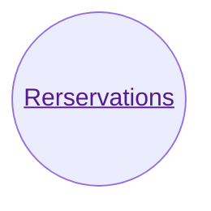

# System Overview

## Bounded Context

For now we only have the reservations bounded context.

```mermaid
flowchart LR

Reservations((<a href=''>Rerservations</a>))

```

Find more details on each bounded context:

- [Reservations](reservations.md)
