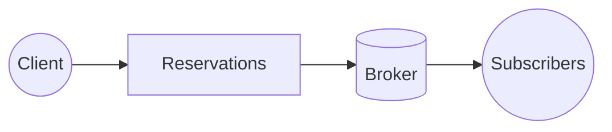
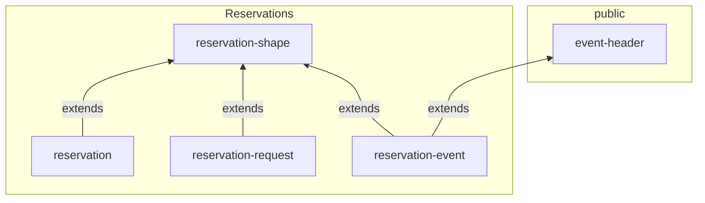
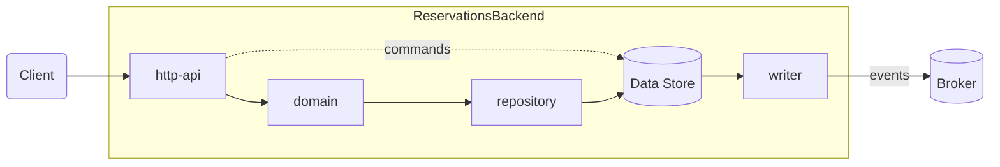

# Reservations Bounded Context

## Notes

### About command storage

- Commands will be stored in the DB best effort. They are used for traceability but not being able to store a command should not make the request fail.
- The command id will be used for traceability on the subsequent event. If the command cannot be stored, the subsequent event will be orphan.

### About event publication

- Events will be published using the outpost pattern.
- Not all information stored by the reservations service will be made public, so the event publisher is part of the reservations bounded context and will control what information is published what information will not.
- Therefore, the publisher can also be used as a sort of anti corruption later for outgoing messages, so we can update the internal model without breaking our subscribers.

## Context

## Data

### Schemas

## Modules

### Module Decomposition

